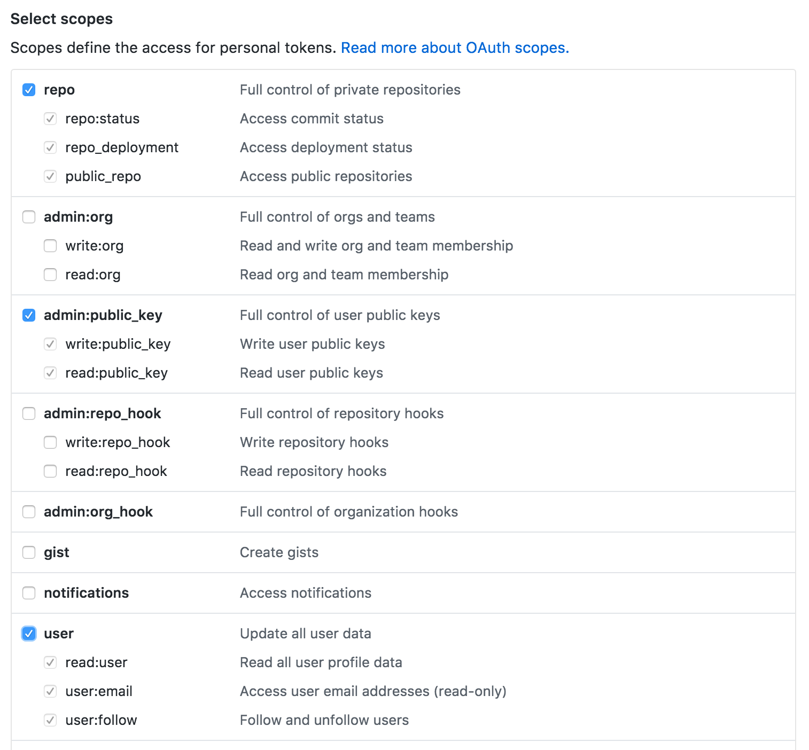

Getting Started
===============

To get started, Lando needs to know where your code lives.

- [Start from an existing codebase](#start-with-an-existing-codebase)
- [Start from Github](#start-from-github)

Start with an existing codebase
-------------------------------

If you have a codebase that isn't on Github, then you'll want to download the code and switch to the directory that contains the code for your app.


1. Run lando init

  `lando init myapp`

  This will initialize a dialogue which will guide you through the rest of the process, including selecting a [recipe](./../config/recipes.md) that is closest to the kind of app you want to run and creating a `.lando.yml` file in the root of your app directory, which should look somethint like this:

  ```yml
  name: myapp
  recipe: lamp
  ```

2. Run `lando start`

  ```bash
  # Start up your app
  lando start
  Creating network "myapp_default" with the default driver
  Creating volume "myapp_appserver" with default driver
  Creating volume "myapp_data" with default driver
  Creating myapp_appserver_1
  Creating myapp_database_1
  Creating myapp_unisonappserver_1
  Recreating lando_proxy_1

  BOOMSHAKALAKA!!!

  Your app has started up correctly.
  Here are some vitals:

   NAME      myapp
   LOCATION  /Users/pirog/Desktop/work/lando/examples/started
   SERVICES  appserver, database, unisonappserver
   URLS      https://localhost:32778
             http://localhost:32779
             http://myapp.lndo.site
             https://myapp.lndo.site
  ```

  You can now access your app (in this case just the php info) on any of the accessible (eg green) urls specified!

Start from Github
-----------------

If you already have project source code on Github, you can easily pull it down with Lando.

1. Generate a Github Personal Access Token

  If you don't already have one, simply visit the [personal access token](https://github.com/settings/tokens/new) page in your Github account's settings to generate a new token for Lando (note you will need a [free Github account](https://github.com/join) for this to work). You need to grant the repo, admin:public_key and user scopes:

  

2. Create your project directory.

  `mkdir github-app-name && cd github-app-name`

3. Run lando init

  To instantiate from Github, `lando init` command takes two arguments: your new app's name, and the method of pulling it down. Here we would run...

  `lando init github-app-name github`

  This will initialize a dialogue which will guide you through the rest of the process.

4. Run `lando start`


Discover Services
-----------------

Run `lando info` to see what [services](./../config/services.md) ship with your recipe. You should see that the `lamp` recipe spins up an `appserver` and `database` for use **WITH ONLY THIS APP**. You also will notice that you get some nice additional information about your services such as the database credentials and connection info.

```bash
lando info

"appserver": {
  "type": "php",
  "version": "7.1",
  "via": "apache",
  "webroot": ".",
  "urls": [
    "https://localhost:32801",
    "http://localhost:32802",
    "http://myapp.lndo.site",
    "https://myapp.lndo.site"
  ]
},
"database": {
  "type": "mysql",
  "version": "latest",
  "creds": {
    "user": "lamp",
    "password": "lamp",
    "database": "lamp"
  },
  "internal_connection": {
    "host": "database",
    "port": 3306
  },
  "external_connection": {
    "host": "localhost",
    "port": true
  }
}
```

Use Tooling
-----------

Run `lando` to see if any additional [tooling](./../config/tooling.md) commands are now available. You should see that `lando composer`, `lando php` and `lando mysql` are now all available for you to use **WITH ONLY THIS APP**. Try them out!

```bash
# Get the version of php this app is using
lando php -v

# Interactively install a dependency with composer
lando composer require

# Drop into a shell on the mysql database
lando mysql

# Check which webserver we are using
lando ssh -c "curl appserver" | grep SERVER_SOFTWARE
```
