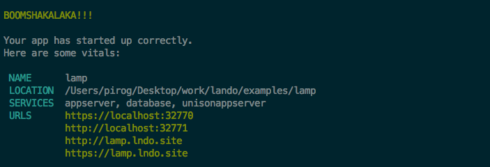
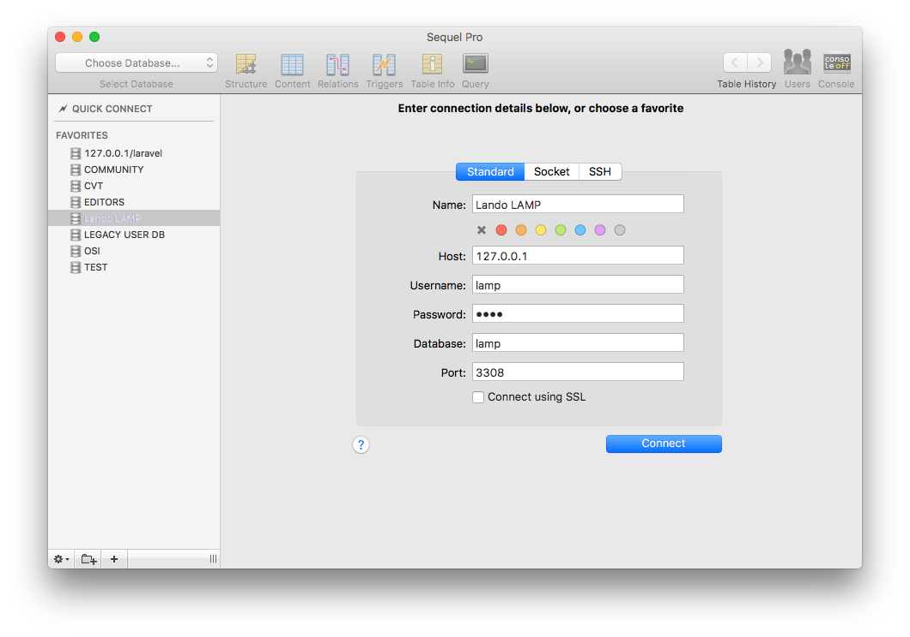

Building Your First Custom App
==============================

Now that you've successfully [installed](./../installation/installing.md) Lando it's time to get rocking with your first app. Let's start by spinning up an app that is more or less what you get with MAMP (except using native linux versions of course).

1. Start up your app
--------------------

```bash
# Clone down the Lando repo so we can use some examples
git clone https://github.com/kalabox/lando.git
cd lando/examples/lamp

# Pull down the images and start the app
lando start
```

> #### Hint::Containers are cached!
>
> The first time you start an app it can take a moment to pull relevant dependencies. Subsequent starts of similar services are cached so they should be *much* faster.

When that app finishes starting you should see some helpful information information about how you can access your app in the browser.



Try visting `http://lamp.lndo.site` in your browser. You should see the `phpinfo()` page.

2. Try some lando commands out
------------------------------

```bash
# Stop the app
lando stop

# Start the app
lando start

# List other apps
lando list
```

3. Modify some php files
------------------------

If you inspect the directory structure of this example app you will see that it contains:

```bash
./
|-- .lando.yml      The Lando configuration for this app
|-- www             The webroot
  |-- index.php     A basic php index file
```

Let's try modifying our php index file.

```bash
# From the app's root directory
echo "<?php var_dump(\$_ENV); ?>" > www/index.php
```

Now try accessing `https://lamp.lndo.site`. You may need to whitelist our self signed cert.

After hitting the browser you should see a vardump of the environment including some [helpful envvars that Lando adds for you](http://localhost:4000/config/services.html#environment). Cool! We can do php things!

4. Accessing the database
-------------------------

Now let's try accessing the database. We can find useful connection and credential information by running `lando info`.

```bash
# From inside our app directory
lando info

{
  "appserver": {
    "type": "php",
    "version": "5.6",
    "via": "apache",
    "urls": [
      "https://localhost:32770",
      "http://localhost:32771",
      "http://lamp.lndo.site",
      "https://lamp.lndo.site"
    ],
    "share": {
      "local": "www",
      "remote": "/var/www/html"
    }
  },
  "database": {
    "type": "mysql",
    "version": "latest",
    "creds": {
      "user": "lamp",
      "password": "lamp",
      "database": "lamp"
    },
    "internal_connection": {
      "host": "database",
      "port": 3306
    },
    "external_connection": {
      "host": "localhost",
      "port": 3308
    }
  }
}
```

Using the mysql client of your choice enter in the following credential and the external connection information to connect to your database.



> #### Hint::Difference between internal and external connection info
>
> If you are trying to access the database from another service eg a php script you will want to use the internal connection information instead.

5. How is this possible?
------------------------

Let's give a brief look at the `.lando.yml` file that makes this possible.

```yml
name: lamp
sharing:
  appserver:
    local: www
    remote: /var/www/html
proxy:
  appserver:
    - port: 80/tcp
      default: true
    - port: 443/tcp
      default: true
      secure: true
services:
  appserver:
    type: php:5.6
    via: apache
    ssl: true
  database:
    type: mysql
    portforward: 3308
    creds:
      user: lamp
      password: lamp
      database: lamp
```

Congratulations! You have now recreated a better version of MAMP. One of many possible configurations you can run with Lando.
